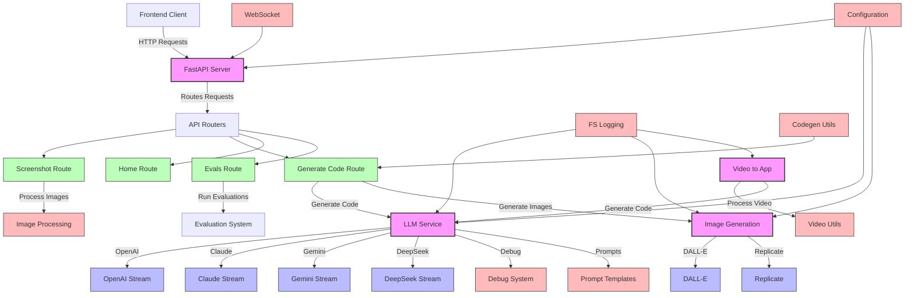

# Screenshot-to-Code Backend Architecture



## Component Descriptions

### Core Components
- **FastAPI Server**: Main entry point for the application, handles HTTP requests
- **LLM Service**: Manages interactions with various language models (OpenAI, Claude, Gemini, DeepSeek)
- **Image Generation**: Handles image generation using DALL-E or Replicate
- **Video to App**: Processes video input and generates corresponding application code

### API Routes
- **Screenshot Route**: Handles screenshot uploads and processing
- **Generate Code Route**: Manages code generation from screenshots or designs
- **Home Route**: Basic application information and status
- **Evals Route**: Endpoints for evaluation and testing

### Supporting Services
- **Image Processing**: Utilities for processing and optimizing images
- **Debug System**: Tools for debugging and logging
- **Prompt Templates**: Predefined prompts for different LLM services
- **Configuration**: Application configuration and environment variables
- **FS Logging**: File system logging utilities
- **Codegen Utils**: Utilities for code generation
- **WebSocket**: WebSocket support for real-time communication
- **Video Utils**: Utilities for video processing

### LLM Providers
- **OpenAI Stream**: Integration with OpenAI models (GPT-4 Vision, GPT-4o)
- **Claude Stream**: Integration with Anthropic's Claude models
- **Gemini Stream**: Integration with Google's Gemini models
- **DeepSeek Stream**: Integration with DeepSeek models

### Image Generation Providers
- **DALL-E**: Integration with OpenAI's DALL-E for image generation
- **Replicate**: Integration with Replicate for image generation
```