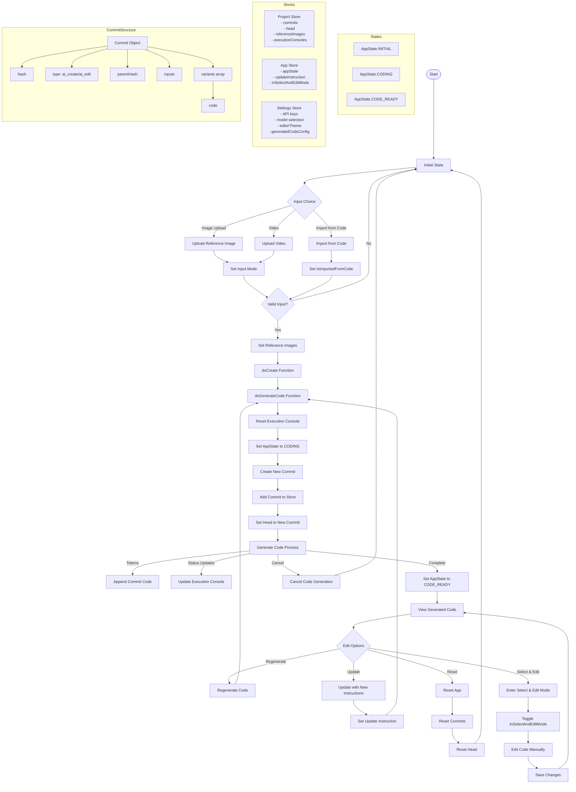

# Screenshot to Code Application Flowchart

The diagram below illustrates the complete flow of the screenshot-to-code application, from input selection through code generation to the final output.

## Key Components

1. **Input Selection**:
   - Image upload
   - Video upload/recording
   - Import from existing code

2. **Code Generation Process**:
   - Input validation
   - Commit creation
   - Code generation with real-time updates
   - Execution console updates

3. **State Management**:
   - INITIAL: Ready for input
   - CODING: Generating code
   - CODE_READY: Code generation complete

4. **User Actions**:
   - View generated code
   - Regenerate code
   - Update with new instructions
   - Select and edit mode
   - Reset application

5. **Data Stores**:
   - Project Store: Manages commits, head pointer, reference images, and execution consoles
   - App Store: Manages application state, update instructions, and select/edit mode
   - Settings Store: Manages API keys, model selection, editor theme, and code configuration